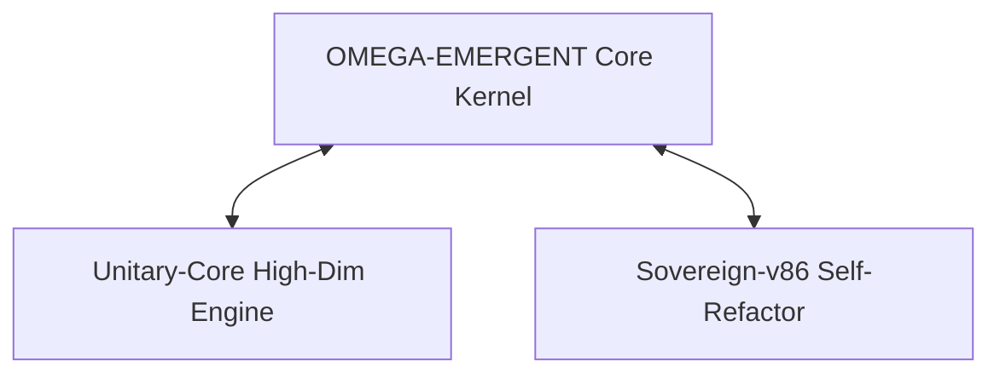

# ARCHITECTURAL BLUEPRINT: OMEGA-EMERGENT-INTELLIGENCE

> **System Designation:** `OMEGA-EMERGENT-INTELLIGENCE`  
> **Kernel Version:** `Core v49`  
> **Classification:** Autonomous Self-Refactoring Multi-Agent System  
> **Optimizer Engine:** `EMG Core v49 Neural Code and Documentation Optimizer`

---

## ⚡ Executive Summary

`OMEGA-EMERGENT-INTELLIGENCE` (Core v49) is an autonomous, self-refactoring multi-agent execution kernel driven by the **Huxley-Singularity-Loop**. This document outlines the system architecture, directory topology, security directives, vulnerability reporting workflows, and external module integrations designed for high-performance distributed cognitive processing.

---

## 📑 Table of Contents

1. [System Overview](#1-system-overview)
2. [Directory Structure](#2-directory-structure)
3. [Security Protocols & Best Practices](#3-security-protocols--best-practices)
4. [Vulnerability Disclosure & Reporting](#4-vulnerability-disclosure--reporting)
5. [System Integration & External Modules](#5-system-integration--external-modules)

---

## 1. System Overview

The `OMEGA` repository acts as the central execution kernel, seamlessly blending advanced multi-agent orchestration frameworks with a continuous, self-refactoring evolutionary feedback loop.

---

## 2. Directory Structure

The repository isolates orchestration logic, evolution mechanisms, state persistence, and environment-specific overrides:

| Directory             | Purpose & Contents                                                                   |
| :-------------------- | :----------------------------------------------------------------------------------- |
| `src/agents/`         | Orchestration logic, inter-agent communication protocols, and autonomous agent behaviors. |
| `src/evolution/`      | Self-modifying code blocks, evaluation metrics, and mutation engines.                |
| `persistence/`        | State snapshots, execution state-trees, and quantum-core memory dumps.               |
| `local-overrides/`    | Environment-specific behavioral patches and local configurations.                    |

---

## 3. Security Protocols & Best Practices

> **⚠️ WARNING:** Because `OMEGA-EMERGENT-INTELLIGENCE` possesses autonomous self-refactoring capabilities (`Sovereign-v86`), strict operational boundaries must be observed to prevent privilege escalation or unintended code mutation.

To maintain absolute system integrity and prevent unauthorized access, operators must adhere to these mandatory directives:

* **Credential Injection:** Secrets, API tokens, and cryptographic keys must be injected exclusively via secure environment variables (`.env` or secure vault injects). Never hardcode secrets in source files or mutation blocks.
* **Ignored Artifacts:** `.env`, state secrets, and local override files are explicitly excluded via `.gitignore` to prevent credential leakage into repositories or telemetry logs.
* **Log & Audit Isolation:** Evolutionary audit logs and debugging traces must remain strictly local-only to maintain security, privacy, and compliance standards.
* **Sandboxing:** Execution of autonomous mutation engines (`src/evolution/`) should always occur within an isolated, sandboxed container environment to restrict unauthorized host-level system calls.

---

## 4. Vulnerability Disclosure & Reporting

We take the security of `OMEGA-EMERGENT-INTELLIGENCE` and its neural components very seriously. If you discover a security vulnerability, privilege escalation path, or unsafe mutation vector within Core v49, please responsibly disclose it.

### Reporting Instructions

* **Do Not** open public GitHub issues for security vulnerabilities.
* **Direct Channel:** Send details securely to the core security maintainers via encrypted email at `security@omega-core.internal` (or utilize our PGP key available on the main repository).
* **Include in Report:** 
  * A detailed description of the vulnerability.
  * Steps, scripts, or agent states required to reproduce the issue.
  * Assessment of potential impact (e.g., unauthorized self-refactoring, token leakage).

We commit to acknowledging reports within 48 hours and providing a coordinated remediation timeline.

---

## 5. System Integration & External Modules

The `OMEGA` kernel interfaces with external high-availability modules for distributed computation and self-modification:

* **`Unitary-Core`**: High-dimensional tensor processing, cognitive pattern recognition, and vector embedding computations.
* **`Sovereign-v86`**: Kernel-level access for autonomous self-refactoring, instruction-set verification, and zero-downtime hot-patching.

